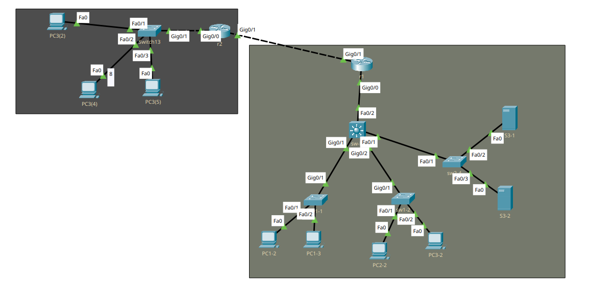

Статическая маршрутизация, это когда ты прописываешь все маршруты трафика вручную.


<center>Рисунок 1 - сеть с двумя "филиалами"</center>

Здесь мы берём две сети из 9-ого урока и соединяем их вместе. Первым примером будет прямой линк между роутерами двух филиалов.

Соединяем и настраиваем соединение между двумя роутерами.

Выдаём адрес одного роутера другому и наоборот

```
int gi0/0 
(с двух сторон)

ip ad 192.168.70.2 255.255.255.252 
(маска мелкая, т.к. тут хватит двух ip-шников. 
70.1 даём роутеру с другой стороны (та же подсеть))
```

Пробуем пропинговать роутеры - соединение есть.
Пробуем пропинговать ПК одного филиала с ПК другого, а тут никак)

```
Destination host unreachable
```

Почему? А маршрутов то нет) 
Роутер ещё можно увидеть, а ПК за L3 коммутатором - нет

Пропишем default route 

```
ip route [V]
S* 0.0.0.0/0 [1/0] via 192.168.70.1
```

Почти готово, фрейм доходит до адресата, он отправляет его обратно, но на роутере другого филиала нет default route, пропишем его (то же, что и выше, но 70.2). Пинги доходят, филиалы соединены! 

Но так может быть не особо безопасно, при нужде в изоляции трафика, так что лучше прописать отдельно маршрут на каждую подсеть (192.168.2.0 3.0 4.0).

Усложним схему добавив к ней ещё один роутер между роутерами двух филиалов.

Настройка схожа: ставим роутер между филиалами, кидаем линки на оба филиала, назначаем IP роутера такой же, какой был у одного из филиалов до установки этого, перенастраиваем роутер, ip которого поставили вместо нового (чтобы не прописывать маршруты на втором), прописываем маршруты и готово! Пинги есть, всё работает