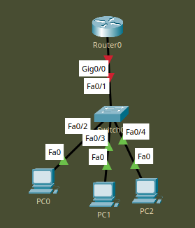
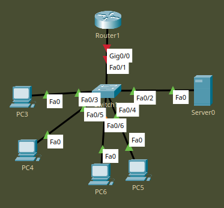
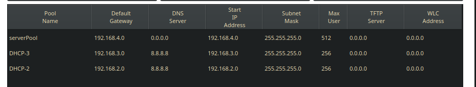

DHCP - технология динамического маршрутизирования. 
Лень писать айпишник на тысячи компов в предприятии? DHCP поможет!

Работает с помощью DHCP-сервера которым может быть и роутер и отдельная машина. 

Принцип работы:
DHCPDISCOVER - клиент говорит серверу "о, я тебя нашел"
DHCPOFFER - сервер говорит клиенту "этот IP возьмёшь?"
DHCPREQUEST - клиент говорит "ок, давай"
DHCPACK - сервер говорит "на, держи"

___



Есть у нас такая сеть, DHCP-сервер - роутер.

DHCP выдаёт айпишники, а откуда ему их брать? Для него нужно создать pool адресов, которые он сможет назначать устройствам.

Настраиваем роутер:

```
in gi0/0
ip address 192.168.1.1 255.255.255.0
ex
ip dhcp pool DHCP
network 192.168.1.0 255.255.255.0
def 192.168.1.1 
dns-s 8.8.8.8 (так в проде не надо, у нас должен быть собственный днс)
ip dhcp ex 192.168.1.1
ip dhcp ex 192.168.1.100
```

Задаём адреса интерфейсу, создаём DHCP-pool .2 -> .255, настраиваем DNS, убираем из пула дефолт-гейтвей и адрес самого роутера.

Делаем DHCP Request на ПК и получаем сетевые настройки, ура!

___

Создаём схожую сеть, но теперь у нас есть 3 VLAN-а как в десятом уроке.



Здесь DHCP-сервером является Server0.

Поскольку у нас есть VLAN-ы, нам нужно настроить свич, а именно - создать вланы и настроить порты

```
in r ..
sw m a
sw a v ..
..
sw m t
sw t a v 2,3,4
```

Свитч теперь работает корректно, настраиваем сабинтерфейсы для каждого VLAN на роутере

```
in gi/0. ..
en d ..
ip ad .. ..
```

и добавляем статический адрес dhcp-сервака, чтобы роутеру было проще его найти

```
ip help 192.168.4.2
```

Адрес на роутере забит, настраиваем сервак, создав пулы для каждого vlan-a

