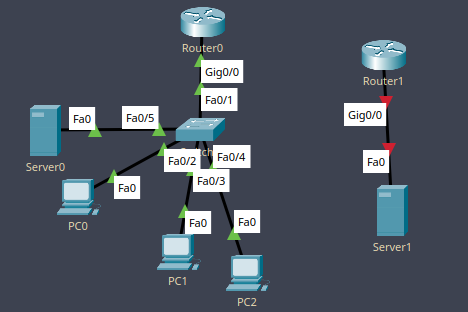
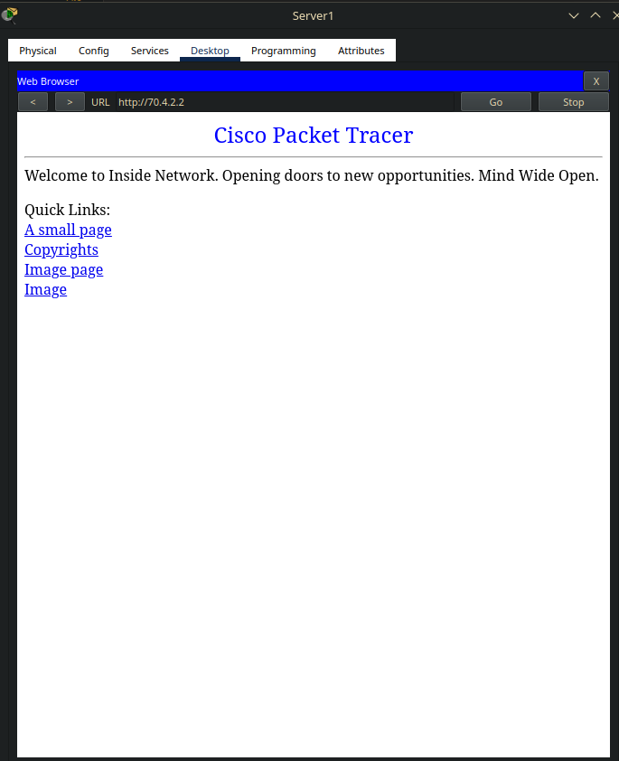

Network Address Transmition - технология, позволяющая использовать триллионы устройств при ограниченном числе адресов в сети интернет.

Существуют белые и серые IP-адреса, 
Белый - публичный (сервак майнкрафта можно запускать без хамачи), 
Серый - частный (внутри сети провайдера, так что, если вы не находитесь с другом относительно рядом в городе, и не используете одного и того же провайдера, вам будет нужен хамачи)

Серые адреса можно выделить по классам:
10.0.0.0/8 - Класс А, 16 миллионов адресов
172.16.0.0 - 172.31.0.0 - Класс B, 65 тысяч адресов
192.168.0.0/16 - Класс C, 256 адресов.

Эти адреса не маршрутизируются в интернете, экономя провайдеру IP-адреса.

Типы NAT:

Статика (ручками прописанный)
Динамика (присваивание доступного)
Перегруз (куча устройств на одном адресе)
___

Приступим к настройке!

Создаём простую сеть с отдельным сегментом для сервера.


Настраиваем..

ПК - VLAN 2, 
Сервер - VLAN 3.

На свиче создаём VLAN-ы и задаём портам их типы (trunk, access)
На роутере создаём сабинтерфейсы и прописываем IP-адреса для VLAN-ов.

Поскольку CPT не работает с настоящим интернетом, мы просимулируем работу NAT-а используя сегмент сети справа с роутером и сервером, где будет белый IP-адрес. 

Соединяем роутеры перекрёстным кабелем и конфигурируем внешний роутер.
```
ip ad 70.4.2.1 255.255.255.252 (белый для роутера внутренней сети)
ip ad 70.4.3.1 255.255.255.252 (белый для роутера внешней сети)
```

На роутере внутренней сети назначаем адрес интерфейсу подключения к внешнему роутеру и создаём default gateway 
```
ip address 70.4.2.2 255.255.255.252
ip route 0.0.0.0 0.0.0.0 70.4.2.1
```

Сеть настроена, внутри сети пинги есть, но не на внешнюю сеть, ибо нет маршрутов.

Поскольку мы здесь работаем с NAT, просто так маршруты прописывать не хочется. Пропишем NAT на интерфейсы и сабинтеррфейсы роутера внутренней сети

(ip nat inside/outside)

Теперь нужно создать Access List на роутере внутренней сети для разграничения доступов.

```
ip ac s nat
p 192.168.2.0 0.0.0.255
p 192.168.3.0 0.0.0.255

ip nat inside source list nat interface gi0/0 overload
```

Второй параметр - обратная маска, последняя команда определяет, что откуда и куда будет пробрасываться NAT-ом.

Пингуем с компа внешний сервер, пинги идут!

Настроим статик NAT для доступа к вебу (порт 80) c внешней сети

```
Router(config)#ip nat inside source static tcp 192.168.3.2 80 70.4.2.2 80
```

```
Router#sh ip nat translations
Pro Inside global Inside local Outside local Outside global
tcp 70.4.2.2:1025 192.168.2.4:1025 70.4.3.2:80 70.4.3.2:80
tcp 70.4.2.2:80 192.168.3.2:80 --- ---
tcp 70.4.2.2:80 192.168.3.2:80 70.4.3.2:1044 70.4.3.2:1044
```

один транслейшн мб случайно создал, но веб извне к локальным ресурсам теперь работает! 