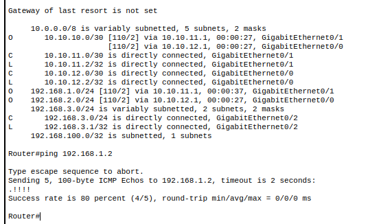
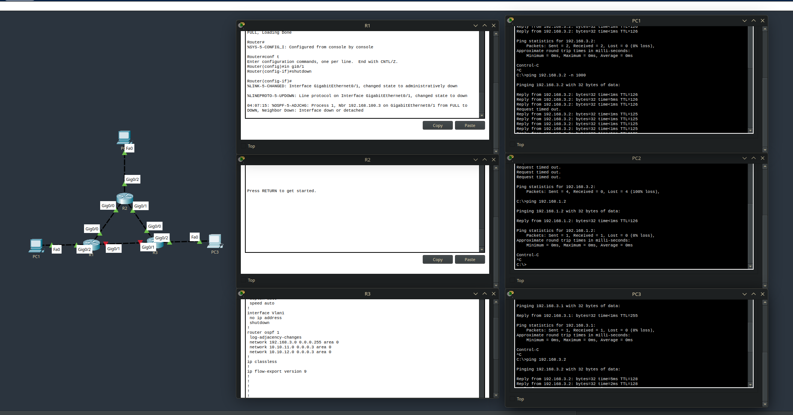

Что такое Open Shortert Path First было подробно разобрано в 7-ой лекции Садыкова, но вкратце: 

Это протокол состояния каналов, который видит всю топологию сети и позволяет без лишней настройки динамически маршрутизировать трафик.

Плюсы динамической маршрутизации относительно статической:
 - Автоматическое добавление маршрутов  
 - Высокая отказоустойчивость (упал один линк != упала сеть, маршрут перестроится с учётом недоступного)
Минусы:
 - Нагрузка на CPU/RAM больше, чем при статике
 - Нужно **очень хорошо** знать сети для поиска проблем в сетях с OSPF
 - Работа сети организуется менее предсказуемо

Но OSPF и RIP - не единственные протоколы, хоть и самые популярные. 

Разберём по группам: 
- Exterior Gateway Protocol (EGP, BGP)
- Interior Gateway Protocol (RIP, OSPF, EIGRP, IGRP, IS-IS)
	- Distance-Vector (RIP, IGRP, EIGRP)
	- Link-State (OSPF, IS-IS)
Внешняя маршрутизация работает внутри Автономных Систем (AS), 
AS - группа роутеров под общим управлением, пример такой группы - сеть интернет-провайдера. 

Провайдер маршрутизирует белые айпи-адреса, которые он сообщает внешнему миру для дальнейшей связи. 
Для этого, кроме белых айпи-адресов, провайдер покупает себе номер AS, c помощью него и протоколов внешней маршрутизации осуществляется обмен маршрутами с внешним миром (интернет, множество AS).

___

Перед началом работ требуется настроить интерфейсы на роутерах и построить простейшую сеть.


Так же, для корректной работы маршрутизации, требуется настроить Loopback-интерфейс.

Loopback-интерфейс - логический интерфейс, который позволяет не ломать весь OSPF при изменении в топологии (какое-то устройство в сети упало)

```
in l 0
ip ad 192.168.100.1 255.255.255.232
```

Теперь мы можем настроить сам протокол маршрутизации с помощью команды `router ospf 1`

Смотрим, какие сети у нас подключены к роутеру и разрешаем их к маршрутизированию с помощью `network <ip> <wildcard> area <id>`.

Для корректной работы маршрутизирования, все роутеры, не выходящие в интернет, должны находиться в одной area. 

OSPF должен автоматически включиться и работать в заданном диапазоне ip-адресов, один из роутеров настроен!

Повторяем настройку на других роутерах, но loopback меняем на x.x.x.2/.3
Роутеры настроены, проверяем проложенные маршруты и пингуем компьютер из сети, отличной от роутера 


`sh ip ro` выдаёт все доступные роутеру маршруты, пинги работают!

Проверим отказоустройчивость канала, выключив линк на одном из роутеров



Пинги продолжают работать, маршрут автоматически перестроился.