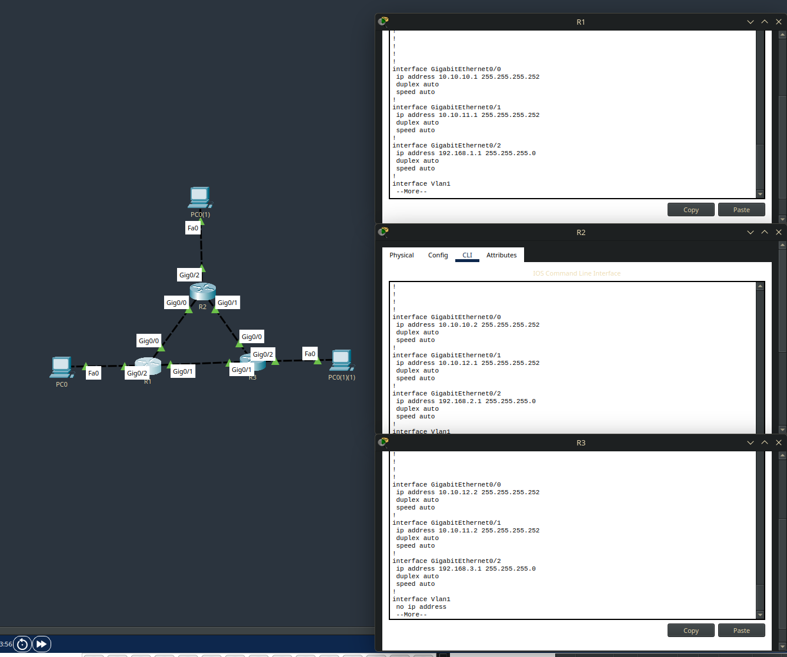

EIGRP (Enhanced Interior Gateway Routing Protocol) - iGRP, но получше.

Практика:

Возьмём сеть из предыдущего урока и удалим OSPF на всех роутерах с помощью команды `no router ospf 1`.

в режиме конфигурации пишем `router eigrp 1`, настраиваем сети...

короче, настройка тут максимально схожа, просто нету area в `network <ip> <wildcard>`, скип, ничего не показать.