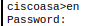
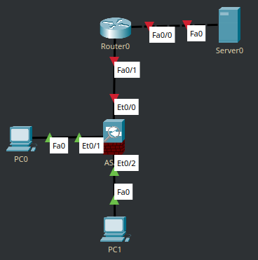

Adaptive Security Appliance - устройство обеспечения сетевой безопасности, устанавливаемое на периметре сети в сегменте серверов, или, иными словами, межсетевой экран.

Общие функции с маршрутизатором:
- Работа с динамической маршрутизацией
- NAT
- Access List (фильтрация трафика)
- VPN (STS, Remote Access VPN)

Прежде всего, ASA - штука для работы с безопасностью, функции с маршрутизаторами хоть и пересекаются, но не полностью и в некоторых кейсах такое отдельное устройство - необходимость.

Уникальные функции ASA:
- [Stateful Packet Inspection](https://en.wikipedia.org/wiki/Stateful_firewall)
- [Identity Firewall](https://www.twingate.com/blog/identity-firewall)
- [TrustSec](https://www.cisco.com/site/us/en/solutions/networking/trustsec/index.html)
- Улучшенный VPN
- [IPS](https://www.cisco.com/c/en/us/td/docs/security/asa/quick_start/ips/ips_qsg.html)
___

Рассмотрим работу данного устройства, на примере ASA 5505, в Cisco Packet Tracer, увы, его работа сильно ограничена. 

И при первом входе мы захотим войти в привилегированный режим, но увидим сообщение о пароле, который надо ввести. 
По умолчанию он пустой, так что, нажмём Enter, если надо - поменяем командой `enable password <password>`.

Создадим простую сеть, где ASA может использоваться.

Cooper отмечает, что 5505, скорее является L3 коммутатором с функцией межсетевого экрана, чем отдельным устройством, ввиду своего функционала и возможностей, другие ASA больше воспринимаются как роутеры с теми же функциями.

```
interface Vlan1
nameif inside
security-level 100
ip address 192.168.1.1 255.255.255.0
!

interface Vlan2
nameif outside
security-level 0
ip address dhcp

telnet timeout 5
ssh timeout 5
!

dhcpd auto_config outside
!
dhcpd address 192.168.1.5-192.168.1.36 inside
dhcpd enable inside
```

ASA имеет в себе некоторые преднастроенные элементы вроде DHCP-сервера и имён интерфейсов (nameif), так как они используются для применения политик безопасности

Настроим логин/пароль командами `enable password <password>` (или лучше `enable secret`) и `username admin password <password>` и проверим `sh r`. 

Пароль, по стандарту, будет зашифрован, когда на маршрутизаторах, эта опция включается вручную с помощью `service password-encryption`.

Настроим SSH
```
ciscoasa(config)#ssh 192.168.1.0 255.255.255.0 inside
ciscoasa(config)#aaa auth ssh console LOCAL
```

Эти команды разрешают доступ к ASA по внутренней сети и говорят ASA использовать локальную БД учётных записей.

Ещё кое-что, что есть в настройках сети - security-level.
Security Level - уровень доверия к сети, 100 - самое большое доверие, 0 - самое маленькое. Внешняя сеть - самая опасная, внутренняя соответственно.

По умолчанию:

- трафик с более высокого уровня → на более низкий разрешен
- с низкого → на высокий запрещен (если нет ACL)

Этот показатель связан с функцией Stateful Inspection: ASA отслеживает сессии, и ответный трафик разрешается автоматически.

Для того, чтобы доставка пакета прошла успешно, ASA записывает "сессию", которая обязательно должна начаться с сегмента сети с бОльшим security-level, сессия записывается в соответствующую динамическую таблицу и пакеты успешно доставляются.

Настроим SI:

Для начала, нужно создать class-map и policy-map. Классовая карта определяет критерии обработки трафика (какой), а Policy определяет, что с трафиком определённого типа делать.

```
ciscoasa(config)#class-map map
ciscoasa(config-cmap)#match default-inspection-traffic
ciscoasa(config-cmap)#policy-map global_policy
ciscoasa(config-pmap)#class map
ciscoasa(config-pmap-c)#inspect icmp
ciscoasa(config-pmap-c)#service-policy global_policy global
```

Теперь веб-сервер недоступен, т.к. внутренняя сеть изолирована, и инспектируются лишь ICMP пакеты.

Настроим NAT:

У ASA настройка NAT работает с помощью `object network`, где мы определяем подсети и NAT (subnet .., `nat (inside, outside) dynamic interface`).

Пробуем пинг, пинг пошел, через NAT теперь проходят пакеты