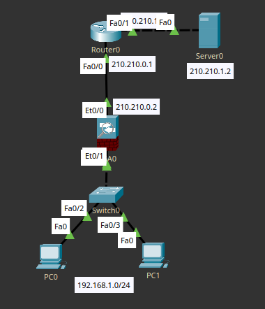
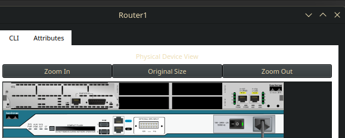

Demilitarized Zone - участок сети, содержащий общедоступные сервисы и имеющий доступ как к внешней сети, так и ко внутренней.

Её возможно реализовать с помощью межсетевого экрана (ASA) с помощью, а так же с помощью маршрутизатора с настроенным Zone Based Firewall или Context Based Access Control (старая вещь).

Обычно, при настройке сети, выделяют три зоны:
 - outside
 - DMZ
 - inside
и создают три основные политики
 - inside -> outside
 - inside -> DMZ
 - outside -> DMZ


Построим простую сеть с ASA, где есть внешний мир и внутренняя сеть.
У внутренней сети уровень доверия - 95, у внешней - 0 (думаю понятно почему).

В роли DMZ-сегмента сети будет выступать сервер, непосредственно подключенный к межсетевому экрану. Приступим к настройке.

Поскольку это отдельный сегмент сети, нам понадобятся Белый IP-адрес и VLAN для DMZ. IP провайдер дал (предположим), и он уже есть на каком-то интерфейсе, подключим сервер и настроим.

Но прежде, чтобы другие сегменты сети смогли найти этот белый IP, провайдер должен его прописать. Вместо маршрута у нас просто роутер, пропишем.

```
ip route 210.210.3.0 255.255.255.252 210.210.0.2
```

210.210.3.0 - подсеть DMZ, 210.210.0.2 - IP ASA.

Настраиваем ASA. В Cisco Packet Tracer работа с DMZ ограничена, поэтому придётся поиграться, чтобы хоть как-то с ними работать.

```
interface Ethernet0/2
switchport access vlan 3
...
nameif dmz
```

Последняя команда выдаёт ошибку, т.к. работа интерфейсов ограничена и нужно с помощью команды no forward определить, в какой интерфейс не пойдёт трафик.

```
ciscoasa(config-if)#int vlan 3
ciscoasa(config-if)#no forward interface vlan 1
ciscoasa(config-if)#security-level 50
ciscoasa(config-if)#ip address 210.210.3.1 255.255.255.252
ciscoasa(config-if)#no shutdown
ciscoasa(config-if)#ping 210.210.3.2
.!!!!
Success rate is 80 percent (4/5), round-trip min/avg/max = 0/0/1 ms
```

Теперь с ASA можно достучаться до DMZ-сегмента, пропишем access-листы, чтобы другие участки сети тоже имели доступ к DMZ.

```
ciscoasa(config)#access-list FROM-OUTSIDE extended permit icmp any host 210.210.3.2
(ну и http вдобавок)
```

Проверим пинги и HTTP с внешнего сервера, всё работает хорошо.
DMZ настроен, но доступа из внутренней сети не будет, т.к. у нас прописан `no forward interface vlan 1`, из-за чего мы не можем проводить трафик в эту сеть.

Попробуем иную реализацию, без ASA. Zone Based Firewall rules, но его нет в Cisco Packet Tracer, поэтому реализуем с помощью CBAC.

Сеть точно такая же, вместо ASA - роутер. Модифицируем его конфигурацию, добавив сетевых интерфейсов, подключим его кабелем-кроссовером к сети провайдера и начнём настройку.


Сначала настраиваем интерфейсы:
- задаём `description` для удобства
- назначаем IP-адреса
- определяем роли:
    - интерфейс в интернет → `ip nat outside`
    - интерфейсы в LAN и DMZ → `ip nat inside`
Далее:
- настраиваем NAT (обычно PAT через access-list для выхода во внешний мир)
- прописываем default route в сторону провайдера
- создаём access-list для контроля трафика между зонами
Основная логика CBAC:
```
ip inspect name <name> <protocol>
```
это включает stateful-инспекцию для выбранных протоколов (например tcp, udp, icmp)

затем применяем:
```
ip inspect <name> in
```
на интерфейс (обычно на границе inside → outside)

CBAC:
- отслеживает сессии
- автоматически разрешает ответный трафик
- работает похожим образом на stateful firewall в ASA

в итоге:
- inside → outside разрешён через NAT + inspect
- outside → DMZ регулируется access-list
- inside → DMZ контролируется отдельно (ACL или inspect)

по сути, это более "ручная" реализация firewall-логики через маршрутизатор, где нужно явно управлять NAT, ACL и инспекцией трафика.