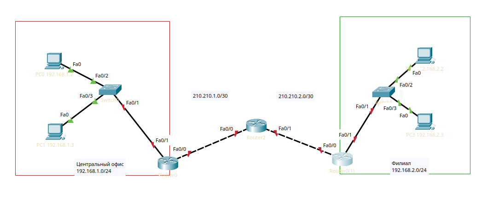

Что такое VPN, думаю, знают все русские, но если не знаете, 
VPN = Virtual Private Network.

В корп. сегменте это то, что позволяет организовать удалённый доступ к серверам (RA) или объединить сети нескольких филиалов в одну сеть (Site to Site).

RA - софт с клиентом вроде WG, OpenVPN
S2S - системные штуки вроде IPSec.

Приступим к практике, есть два филиала и роутер провайдера, нужно объединить филиалы.



Настраиваем NAT на роутерах и поднимаем интерфейсы от центрального офисе к провайдеру

```
interface FastEthernet0/0
 ip address 210.210.1.2 255.255.255.0
 ip nat outside
 no shutdown

interface FastEthernet0/1
 ip address 192.168.1.1 255.255.255.0
 ip nat inside
 no shutdown
ip route 0.0.0.0 0.0.0.0 210.210.1.1
ip access-list standard for-nat
permit 192.168.1.0 0.0.0.255
ip nat inside source list for-nat interface fa0/0 overload
```

Пинг центрального офиса к провайдеру есть, повторяем операцию для филиала, но ip - 210.210.2.1, и 192.168.2.1.

У S2S VPN-ов есть несколько "фаз" авторизации. Настроим первую.

```
Router(config)#crypto isakmp policy 1
Router(config-isakmp)#encr 3des
Router(config-isakmp)#hash md5
Router(config-isakmp)#auth pre-share
Router(config-isakmp)#group 2
```

Первая команда перекидывает нас в настройки туннеля с высшим приоритетом, вторая - метод шифрования, третья - хеширование, четвёртая - принцип авторизации, а именно - PSK (Pre-Shared Key).

PSK — секретная строка, известная обоим роутерам заранее. Она используется для автоматической аутентификации устройств при установке VPN-туннеля.

Настроим PSK для центрального офиса:

```
crypto isakmp key cisco address 210.210.2.2
```

`cisco` — сам ключ, `210.210.2.2` — внешний IP роутера филиала.

Создадим access-list для определения трафика, который должен заворачиваться в туннель.

```
ip access-list extended for-vpn permit ip 192.168.1.0 0.0.0.255 192.168.2.0 0.0.0.255
```

Настраиваем вторую фазу IPSec.

```
crypto ipsec transform-set TS esp-3des esp-md5-hmaccrypto map CMAP 10 ipsec-isakmp set peer 210.210.2.2 set transform-set TS match address for-vpn
```

После этого привязываем crypto map к внешнему интерфейсу.

```
interface FastEthernet0/0 crypto map CMAP
```

Проделываем аналогичные манипуляции на роутере филиала и пробуем пинги. Вроде бы туннель настроен, значит должны быть пинги?

А вот и нет.

Проблема в том, что VPN-трафик попадает под NAT. После трансляции адресов IPSec перестаёт считать трафик "интересным", поэтому пакеты не уходят в туннель.

Чтобы исправить ситуацию, исключим VPN-трафик из NAT, создав новый расширенный ACL.

```
ip access-list extended for-nat deny ip 192.168.1.0 0.0.0.255 192.168.2.0 0.0.0.255 permit ip 192.168.1.0 0.0.0.255 any
```

Для филиала ACL должен быть зеркальным:

```
ip access-list extended for-nat deny ip 192.168.2.0 0.0.0.255 192.168.1.0 0.0.0.255 permit ip 192.168.2.0 0.0.0.255 any
```

На роутере провайдера добавим статические маршруты между сетями филиалов.

```
ip route 192.168.1.0 255.255.255.0 210.210.1.2ip route 192.168.2.0 255.255.255.0 210.210.2.2
```

После генерации трафика между сетями IPSec-туннель поднимется автоматически.

Проверить состояние VPN можно командами:

```
show crypto isakmp sashow crypto ipsec sa
```

Если туннель успешно поднялся, в выводе `show crypto isakmp sa` появится состояние:

```
QM_IDLE
```

S2S VPN поднят, пинги работают. Ура!

А вот с ASA-ми... делать не особо хочется)

Там есть ограничения, из-за которых NAT и VPN одновременно не работают да и настройка +- схожа, так что, ну его.
Из относительно-продвинутого - здесь будет не isamkp, а IKEv1