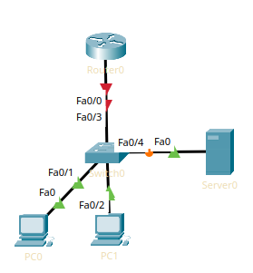

AAA - Authentication, Authorization, Accounting.

Это БД учётных записей (сервер). Работает по протоколам RADIUS и TACACS.

RADIUS шифрует только пароль, работает по UDP (1812-1813, 1645-1646) и является открытым стандартом.

TACACS шифрует всё, работает на TCP/49 и является проприетарным протоколом Cisco.

Начнём практику, возьмём сеть из предыдущей работы, т.к. особо, в самой сети, нам ничего настраивать не придётся  и мы будем работать лишь с AAA.

Нужно лишь настроить IP-адресацию на интерфейсах и назначить всем IP-адреса.


Создадим локального пользователя, для этого нам понадобятся
```
enable secret <пароль>
username <username> priv 15 sec <password>
```

Пользователь есть, настроим терминал на стандартную работу на локальной БД и сконфигурируем telnet.

```
line console 0
login local

line vty 0 4
login local
transport input telnet
```

Проверили работу с ПК, всё работает, но теперь попробуем сделать то же самое, но через `aaa new-model`

`aaa authentication login default local`.

Настроим AAA сервер, в сервере есть гуишка, поэтому расписывать нечего. 
делаем клиента (ссылку на роутер), добавляем пользователей

прописываем `aaa authentication login default group radius local`, дабы брать юзеров с сервера и настраиваем сам сервер с помощью `radius-server host 192.168.2.2 key 123 `

Готово! Пользователи с сервера AAA работают, радиус работает.

```
User Access Verification

Username: hello
Password:
Router>
```

Если радиус-сервер будет недоступен - роутер обратится к локальной бд, т.к. это задано в самой длинной написанной тут команде. 