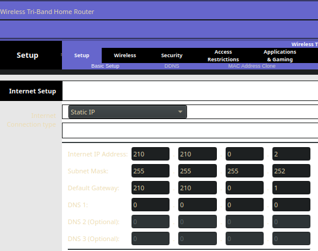
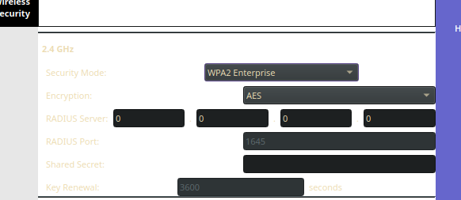
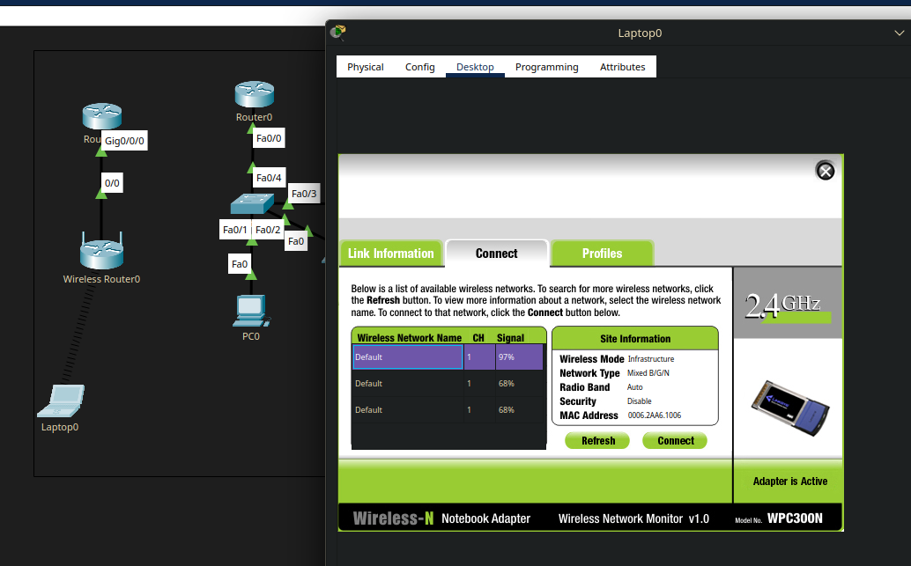

Wi-Fi никак не расшифровывается. Это способ беспроводной передачи данных.

Стандарты:
- 802.11b < 11Mbit/s
- 802.11g < 54Mbit/s
- 802.11n < 600Mbit/s
- 802.11ac < 6.7Gbit/s (8 антенн)
Частоты: 2.4Ггц (надёжность), 5Ггц (скорость).

Wi-Fi в основном испольуется как 
- мост (схоже с vpn, беспроводной "канал"),  
- роутер (получаем WAN и раздаём)
- точка доступа (сеть, которую создал роутер, расшариваем куда нам надо)
  
Перейдём к практике. Берём сеть из предыдущих уроков и кидаем туда беспроводной роутер + обычный роутер "провайдера".

Изучим web-gui 
Здесь много настроек, например настройка статики / dhcp, беспровод. интерфейсов, безопасности. 

В настройках беспровода можно выбрать разные режимы безопасности, среди которых WPA/WPA2 Enterprise и Personal.
Enterprise подключается к RADIUS Server-у, Personal - нет

Проверим работу с помощью ноутбука с модулем Wi-Fi, Wi-Fi можно поймать и подключиться.

Теперь про точки доступа, мы их можем подключить к свичу по соседству. Настраиваются они схоже, в CPT есть гуишка, там настраивается пароль, RADIUS, SSID и прочее-прочее