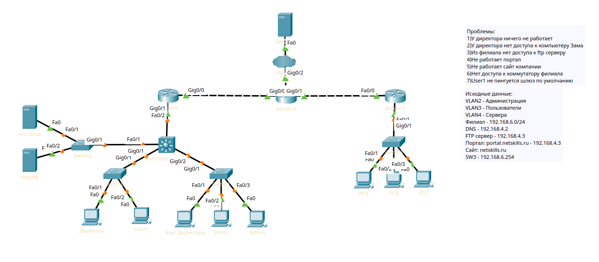

Последний урок курса, ура!

Здесь будет т.с. "проверка знаний". Берём [файл лабы](https://drive.google.com/drive/folders/0B-5kZl7ixcSKajJOY1lNdC0xNFk?resourcekey=0-YjZGwaIe9hK2MP9FmsGsGA), смотрим проблемы, которые там описаны и решаем.

В видео постараюсь не подглядывать)
___



Вот исходная сеть, проблемы и данные которые у нас есть были даны. Начнём.

# 1: У директора ничего не работает

Проверяем это "ничего" пингом до default gateway

```
C:\>ping 192.168.2.1
Pinging 192.168.2.1 with 32 bytes of data:
Request timed out.
Request timed out.
Request timed out.
Request timed out.
```

Да, пингов нет. Смотрим настройки ПК, а там нет IP вообще и DHCP request failed, значит что-то не так с настройками сети на уровнях выше.

```
interface FastEthernet0/1
!
interface FastEthernet0/2
switchport access vlan 3
switchport mode access
```

fa0/1 - ПК Директора, тут настроек вообще нет. Зададим VLAN порту в соответствии с данными (vlan 2).

Сетевые настройки были отредактированы, пробуем сделать DHCP request на ПК Директора, интернет был получен 

# 2: У директора нет доступа к ПК зама

Смотрим какой IP у зама и проверяем пингом с ПК Директора.

Пинги не работают. Проверим, есть ли MAC в arp таблице ПК директора.
```
C:\>arp -a
Internet Address Physical Address Type
192.168.2.3 000b.be91.d6e3 dynamic
```

Да, есть. Сеть исправна, проблема на уровнях выше. Проверяем ПК зама и видим, что на нём есть Firewall, блокирующий все подключения, кроме определённых четырёх. Если доступ нужен директору - добавим правило, разрешающие подключения от него.

Доступ есть, проблема решена.

# 3: Из филиала нет доступа к FTP-серверу

Проверим, работает ли сервер вообще, пропинговав его с админского ПК. Сервер живой, смотрим далее.

Проверяем, доступна ли нам сеть филиала, пропинговав IP-любого ПК филиала. Тоже всё хорошо

Так как между филиалом и клиентом есть много узлов, мы можем попробовать traceroute, дабы понять, на каком узле возникает проблема.

```
C:\>tracert 192.168.4.3
Tracing route to 192.168.4.3 over a maximum of 30 hops:
1 0 ms 0 ms 0 ms 192.168.6.1
2 0 ms 0 ms 0 ms 192.168.10.5
3 0 ms * 0 ms 192.168.10.5
4 * 0 ms * Request
```

Всё падает на .10.5, судя по схеме, это промежуточный Router3.

Проверим наличие маршрутов,

```
S 192.168.2.0/24 [1/0] via 192.168.10.2
S 192.168.3.0/24 [1/0] via 192.168.10.2

192.168.5.0/30 is subnetted, 1 subnets
S 192.168.5.0/30 [1/0] via 192.168.10.2
S 192.168.6.0/24 [1/0] via 192.168.10.6

192.168.10.0/24 is variably subnetted, 4 subnets, 2 masks
C 192.168.10.0/30 is directly connected, GigabitEthernet0/0
L 192.168.10.1/32 is directly connected, GigabitEthernet0/0
C 192.168.10.4/30 is directly connected, GigabitEthernet0/1
L 192.168.10.5/32 is directly connected, GigabitEthernet0/1

210.210.1.0/24 is variably subnetted, 2 subnets, 2 masks
C 210.210.1.0/24 is directly connected, GigabitEthernet0/2
```

Нет маршрута от филиалов (.6) до серверов (.4), исправим.
Маршрут создан, Trace complete.

# 4: Не работает портал

Проверим HTTP с админского ПК, выдало "Host Name Unresolved". Вывод - DNS умер, надо проверить, что с ним.

Да, в настройках DNS есть только netskills.ru, домена вернего уровня (portal...) там нет. Внесём соответствующую исходным данным А-запись.

Всё, портал ожил!

# 5: Не работает сайт компании

Так же проверяем со своего ПК, ошибка Server Reset Connection. 

C нашей стороны проблем нет, говорим "Проблемы не у нас, а у магистралов" и пишем что так и так, сервак недоступен. Магистралы решают проблему (отключенный http на сервере), сайт ожил

# 6: Нет доступа к коммутатору филиала

Ищем IP коммутатора, проверяем пинг. Пинга нет, проверяем tracert.
По tracert пакет доходит до филиала, но обратно никак. 

Проверим, есть ли маршрут по умолчанию, а его нет!

Прописываем, проблема решена.

# 7: User1 не работает пинг до Default Gateway

Да, пингов нет, но всё остальное в порядке. Зайдём на L3 коммутатор и проверим, как там с адресами с помощью команды `debug` дабы понять, приходят ли к свичу icmp-пакеты.

```
Switch#debug ip icmp
ICMP packet debugging is on
ICMP: echo reply sent, src 192.168.3.1, dst 192.168.3.3
ICMP: echo reply sent, src 192.168.3.1, dst 192.168.3.3
```

Пинги доходят, но назад не идут. Наверное пользователь что-то накрутил в своих настройках, проверим. Да, firewall deny на icmp. Уточняем, зачем такая мера могла быть предпринята предыдущими админами и сами отключаем.

Пинги есть, проблема решена.