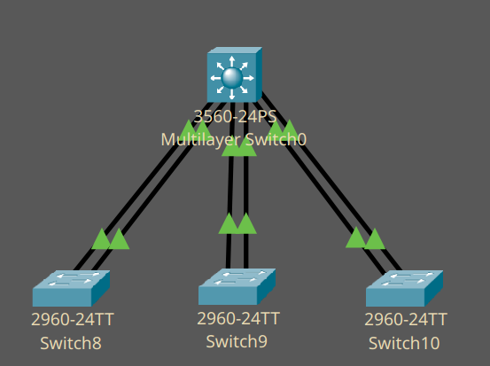

Link Aggregation Channel Protocol - протокол, позволяющий объединять несколько физических интерфейсов в один логический.

Максимально правильно настраивать VLAN-ы именно на логических интерфейсах, не на физических

<center>Рисунок 1 - сеть c L3 sw. связывающим 3 L2 sw.</center>

На рисунке представлена уже готовая сеть, но это не особо важно

L2 и L3 switch-и хоть и оба являются коммутаторами, но подключены прямым проводом, т.к. эти устройства работают на разных уровнях.

В этом примере мы будет агрегировать по два порта на каждый switch.

Подключаем каждый коммутатор, соединяя первые два доступных порта на L3 с двумя первыми портами на L2 
(т.е. FAO/1-2 -> FA0/1-2 на 8, FAO/1-2 -> FA0/3-4 на 9, FAO/1-2 -> FA0/5-6 на 10 свитче) в соответствии с теми портами, которые мы ходим агрегировать.

Заходим на L3 свитч, и пишем

```
en
conf t 
in r fa0/1-2
channel-p lacp
channel-g 1 m a
```

и так для трёх групп соответственно (3-4 вторая, 5-6 третья).
___
(и не забыть wr mem в прив. режиме)
___

Так у нас создаётся PortChannel для каждого коммутатора, но нужно ещё настроить L2 коммутаторы для их правильной работы. 
Команды схожи, но есть одно маленькое, но важное отличие.

```
en
conf t 
in r fa0/1-2
channel-p lacp
channel-g 1 m p
```

Последняя команда расшифровывается как `channel-group 1 mode passive`.
LACP имеет активный режим, инициирующий соединения и пассивный, их принимающий. 

(честно, после минуты гуглинга я не понимаю, почему тут не подойдёт активный режим, ибо active-active хорошо работает, ну да ладно)

Смотрим `sh e s` на L3 коммутаторе, он показывает то, какие PortChannel у нас были настроены и на каких портах.

В случае, если VLAN-ов на настроенных коммутаторах несколько, то магистральный (trunk) порт следует настраивать на логическом интерфейсе

Как создать транк порт:
```
en
conf t
in p 1
sw m t
```
p - port-channel
