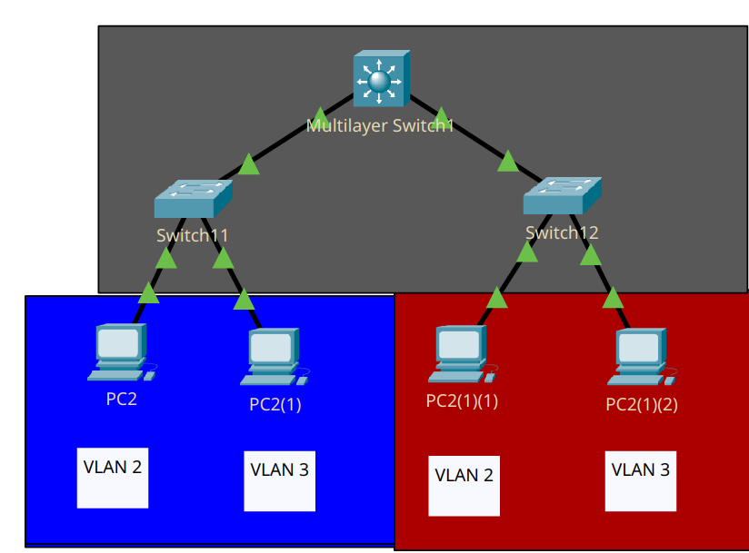

Зачем они нужны было описано в 2-4 + 3-4 файлах, но вкратце: да, они могут выполнять функции роутеров, но они чертовски дорогие) 

Нужны для роутинга трафика между свичами L2 (сегментами сети).


<center>Рисунок 1 - сеть с L3 sw. связывающим два L2 sw. с разными VLAN-ами внутри</center>
___
Настроим L2 коммутаторы:

```
en
conf t
in fa0/1
sw m a
sw t a v 2 
```

Предпоследняя команда задаёт порту режим Access, а последняя автоматически создаст VLAN 2 без имени и присвоит его.

Аналогично настраиваются второй порт (v 3) и 1-2 порты на втором коммутаторе. 
___
Подсоединим L2 switch-и к L3 и изменим режим портов L2 коммутатора на trunk. 

```
in gi0/1
sw m t 
sw t a v 2,3
```

Последняя команда разрешает работу VLAN-ов 2-3 на этом транк-порте.

Аналогично настраиваем второе подключение к L3 коммутатору.
___
Настроим L3 коммутатор:

Поскольку к нему подключены Trunk порты, на стороне L3 нужно так же настроить эти порты как Trunk.

```
en
conf t
in gi1/1
sw t e d
sw m t
sw t a v 2,3
```

Здесь включаются VLAN-теги (trunk encapsulation dot1q) для корректной работы между L2 и L3 коммутаторами и разрешается работа VLAN 2 и 3.

Задаём IP адреса на VLAN интерфейсы

```
in vl 2 
ip ad <ip> <mask>
```
(и 3 соответственно)

Финально, для работы маршрутизация трафика, нужно включить её с помощью команды `ip routing`

___
не забываем wr mem в прив. режиме
___
