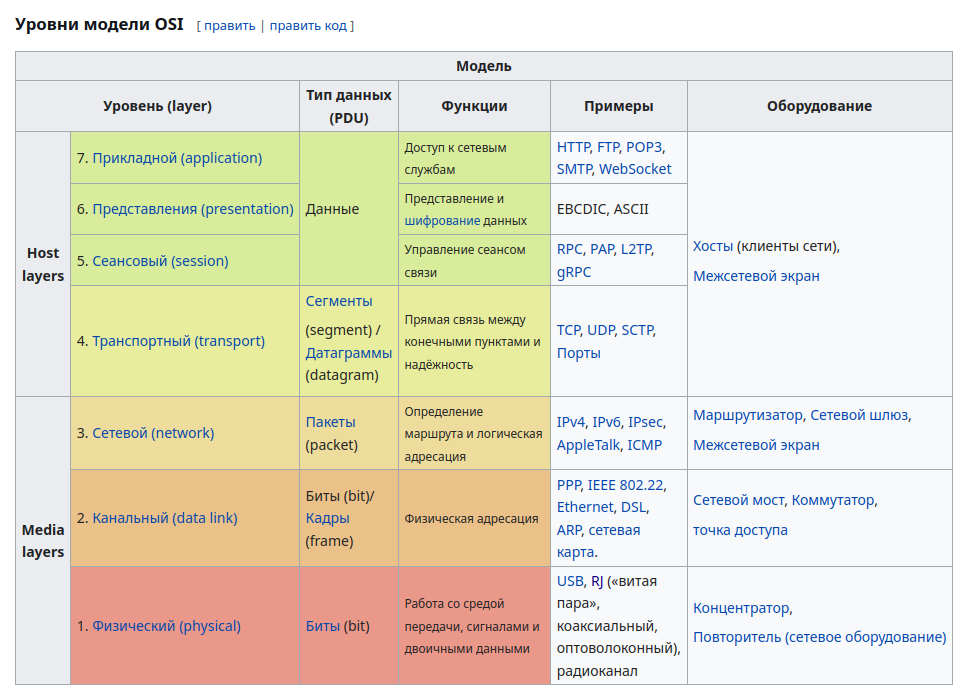

# OSI/ISO

OSI/ISO — эталонная семиуровневая модель построения сетей.


---

# L1 - Физический уровень (Physical layer)

Самый низкий уровень OSI, отвечающий за передачу **битов данных через физическую среду**.

L1 не знает что передаёт - он работает только с сигналами.

Задачи уровня:

- передача сигналов
- преобразование битов в электрический/оптический сигнал
- синхронизация передачи

Средства передачи:

- витая пара (Ethernet)
- оптоволокно
- Wi-Fi (радиосигнал)

Механизм передачи сигналов крайне прост:

Сетевые адаптеры (NIC) выполняют кодирование данных, модуляцию сигнала
и далее, передают готовый сигнал.

На первом уровне адаптеру неизвестно, что такое "пакет", TCP/IP и прочие протоколы.

# L2 - Канальный уровень (Data Link layer)  
  
Отвечает за передачу данных **между устройствами внутри одной сети**.  
  
Если L1 отвечает за передачу сигналов, то L2 отвечает за передачу **кадров (frames)**.  
  
Задачи уровня:  
  
- адресация устройств (MAC)  
- формирование кадров  
- проверка целостности  
- управление доступом к среде

## MAC адрес
  
Каждый сетевой адаптер имеет MAC-адрес.  
  
MAC состоит из 48 бит или шести байтов, разделённых, в группы по два символа.

Первые три байта MAC адреса - ID производителя, последние - ID устройства.

## Структура кадра

Кадр состоит из:

- SOURCE_MAC
- DESTINATION_MAC
- PAYLOAD
- CRC
DESTINATION_MAC нужен для определения получателя данных, 
SOURCE_MAC нужен для определения обратного отправления статуса пакета.
PAYLOAD - полезные данные
CRC - контрольная сумма
## Проверка целостности

Для проверки целостности данных, на L2 используется механизм контрольных сумм, сравнивающий, совпадает ли CRC данных отправителя и получателя. 

```destination
receiver.calculateFrame()
if (!sourceCRC == destinationCRC) {
	frameDrop()
	}
```
Повторная передача выполняется уже механизмами более высоких уровней (например TCP на L4).

## CAM-таблица

В современных сетях, часто используются управляемые устройства (вроде коммутаторов), обеспечивающие полную настройку на каждый порт. 

Для того, чтобы устройство знало, на какой порт нужно отправить кадр, предотвращая широковещательную рассылку, этим устройствам и нужна CAM-таблица (Content Addressable Memory), связывающая MAC-адрес устройства с конкретным портом и VLAN.

## Flood и Broadcast

Если коммутатор не знает DESTINATION_MAC, он выполняет flood - отправляет кадр во все порты, кроме входящего.

Важно понимать разницу:

Flood - способ доставки, когда коммутатор не знает куда отправить кадр. 
Broadcast - тип кадра, который изначально предназначен всем устройствам.

Broadcast MAC: ff:ff:ff:ff:ff:ff 
Такой кадр получают все устройства в пределах одного L2 сегмента.

## MAC learning  
  
Коммутатор изучает сеть автоматически.  
Он не ищет DESTINATION_MAC - он запоминает SOURCE_MAC.  

Механизм:  
  
1. Кадр приходит в порт  
2. Коммутатор смотрит SOURCE_MAC  
3. Запоминает: MAC -> PORT 
После этого коммутатор уже знает, куда отправлять кадры для этого MAC.

## Broadcast Storm  
  
Если между коммутаторами существует петля (loop), broadcast кадры начинают бесконечно циркулировать.  
  
Это может привести к:  
  
- перегрузке сети  
- высокой загрузке CPU коммутаторов  
- потере связи  
Для предотвращения используется протокол: STP, отключая лишние пути и убирая петли.
## ARP (Address Resolution Protocol)

ARP - протокол, позволяющий определить MAC-адрес устройства по его IP адресу.

Работает на границе L2/L3:

IP относится к L3  
MAC относится к L2  

ARP связывает эти уровни.

## Зачем нужен ARP

IP используется для логической адресации, но Ethernet работает через MAC.
Если устройство хочет отправить пакет, оно должно сначала узнать MAC этого устройства.

Без MAC L2 не сможет доставить frame.

---

## Как работает ARP  
  
Если MAC неизвестен, устройство отправляет ARP запрос как broadcast, спрашивая, чей адрес - x.x.x.x, сказать у.у.у.у
  
DESTINATION_MAC при этом: ff:ff:ff:ff:ff:ff  
  
Все устройства сети получают этот запрос, но отвечает только устройство с нужным IP. Далее, устройство с этим маком отвечает на запрос как unicast и добавляет соответствующую запись в ARP Cache
    
---  
  
## Когда выполняется ARP запрос  
  
ARP выполняется если:  
  
- MAC неизвестен  
- запись устарела  
- запись была удалена  
- устройство сменило MAC  
  
---  
  
## ARP и gateway  
  
Если устройство отправляет пакет в другую сеть, то оно не ищет MAC удалённого сервера, а ищет MAC default gateway.
## ARP cache  
  
После получения ответа устройство сохраняет IP -> MAC соответствие в ARP cache, чтобы не делать broadcast каждый раз.
Состояния ARP:  
  
- REACHABLE - адрес доступен  
- STALE - давно не использовался  
- FAILED - недоступен  
- INCOMPLETE - идёт поиск MAC  
  
---  
  
## DHCP (Dynamic Host Configuration Protocol)  
  
DHCP отвечает за автоматическую выдачу:  
  
- IP адреса  
- маски  
- gateway  
- DNS  
  
Работает через broadcast.  
  
DHCP назначает IP c помощью четырёх запросов DORA:  
  
Discover  
Offer  
Request  
Ack  
  
Устройство отправляет DHCP DISCOVER (broadcast - у кого есть dhcp сервер)
Сервер отвечает DHCP OFFER предлагая IP.
Клиент подтверждает выбор с помощью DHCP REQUEST
И сервер подтверждает его с DHCP ACK
  
## DHCP ports  
  
Использует UDP:
67 - серверный порт
68 - клиентский порт

___
источники: первая лекция садыкова